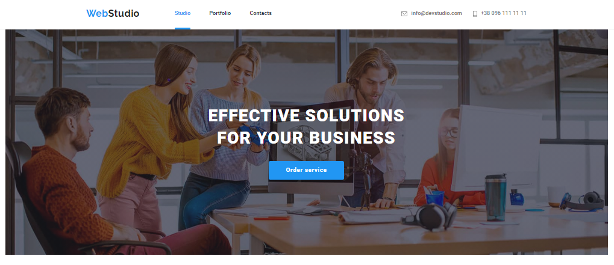
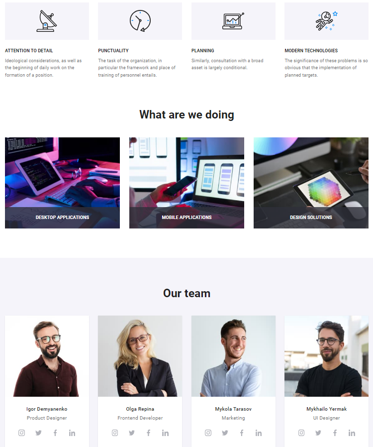
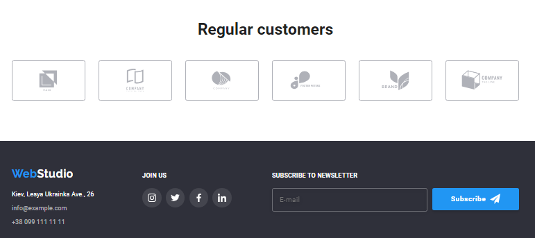
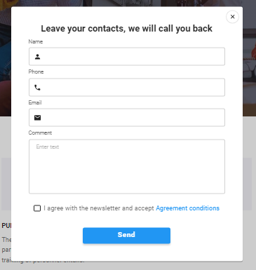
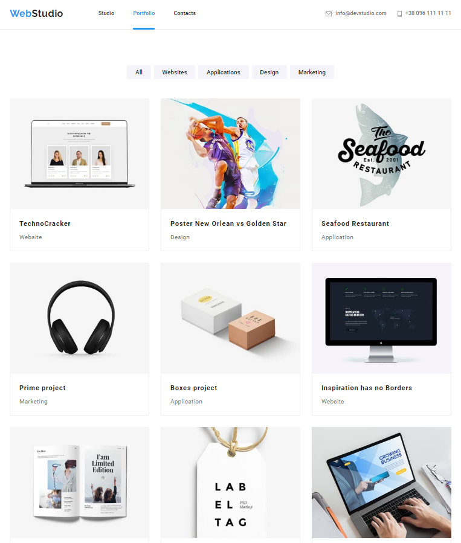
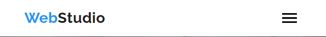
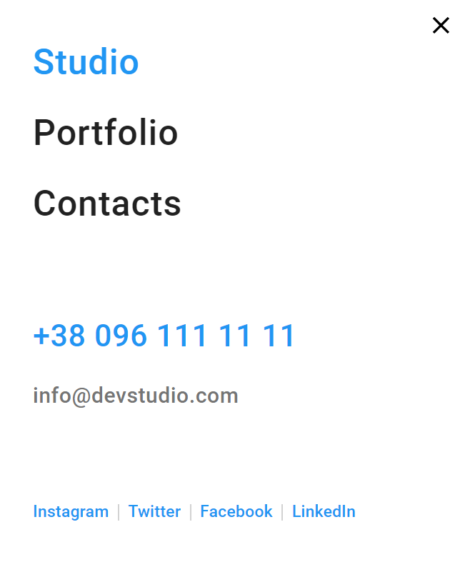

# WebStudio

WebStudio is a site for a design development company
https://webstudiosite-html-css.netlify.app/

## The project used:

`«HTML5»`
`«CSS3»`
`«JavaScript»`
`«Sass (Syntactically Awesome Stylesheets)»`
`«BEM Methodology»`

## Project structure
`The site consists of three main pages: the Studio's main page, the Portfolio page and the Contact page.`
`The studio page contains information about the company, activities, team and regular customers.`

`The standard blocks are the Header and Footer of the page. Which contain contact information for quick communication, a menu for switching between pages, links to social networks and the ability to subscribe to the newsletter.`

`On the main page of the site there is a feedback form where you can leave your contacts.`

`The Portfolio page contains examples of designs and projects already made by the company.`

`The layout is adapted to 3 main screen sizes: desktop, tablet and mobile screen.` 

`Also, all images are adapted for regular and Retina displays.`